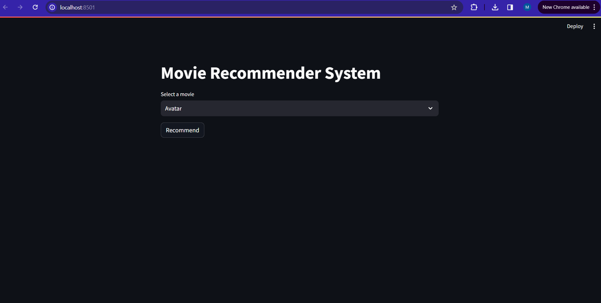
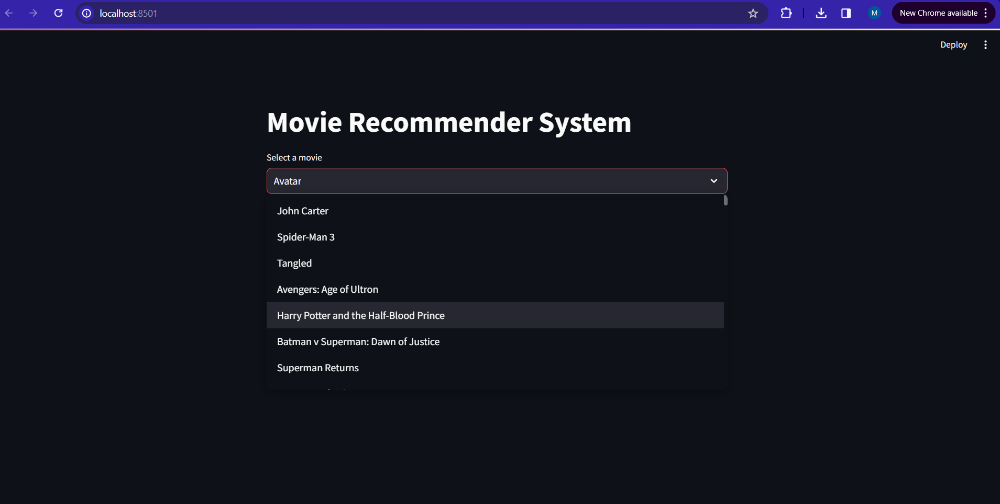
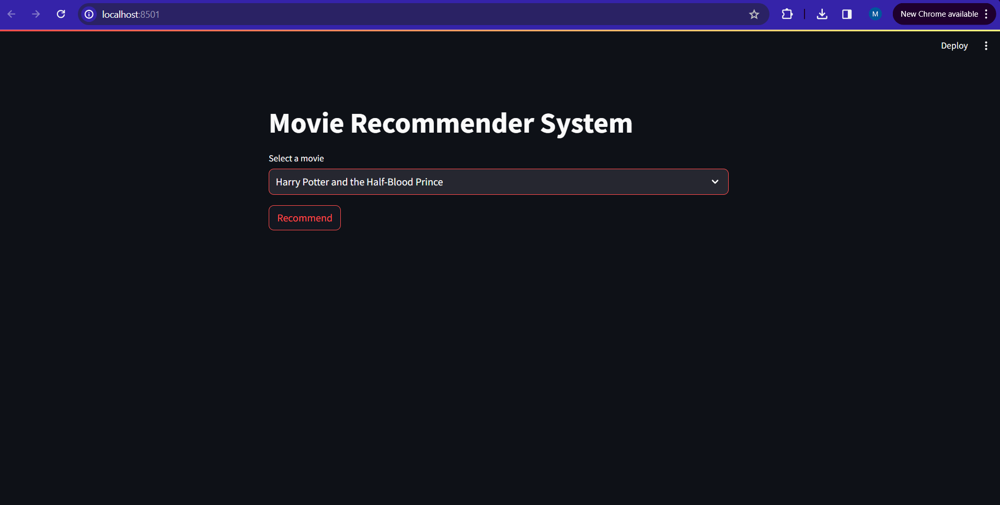
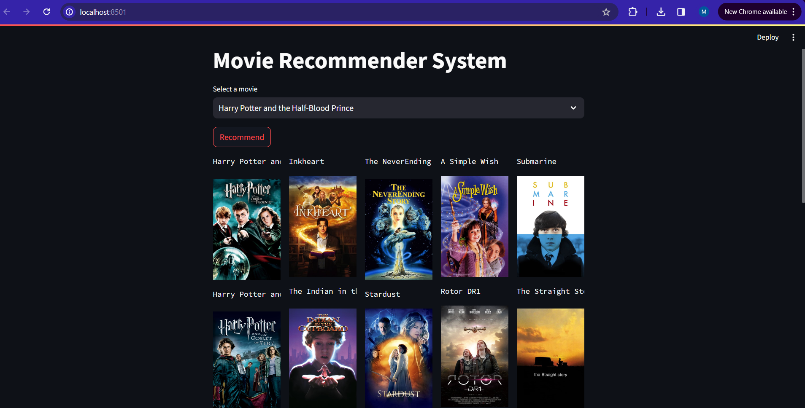
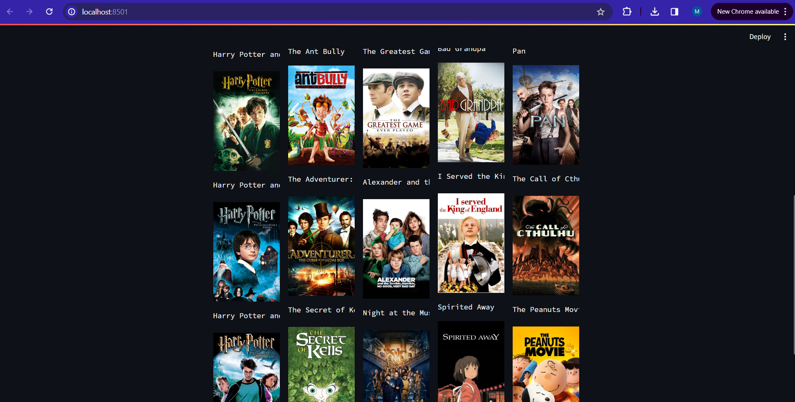

# Movie Recommender

## Brief:
A website that recommends similar movies based on any movie that the user chooses.

## Tech Stack:
- Frontend: Streamlit (run from PyCharm)
- Backend: Python 

## Features:
- Choose a movie from the dropdown menu and click recommend.
- The website will recommend 25 similar movies that you might like, along with the movies' posters.

## ML Model:
- A content-based recommender system is used.
- All related words of a movie are added into a `tags` column in the data.
- Then, the data is vectorized on 5000 features.
- The cosine similarity function is used to compare the vectorized data.

## Dataset used:
https://www.kaggle.com/datasets/tmdb/tmdb-movie-metadata

## Instructions to Run:
- `cd` into `movie-recommender-main`
- Run `movie_recommender_system.ipynb` using Jupyter Notebook.
- 3 new files should be added into the folder: `movies.pkl`, `movie_dict.pkl`, `similarity.pkl`.
- Add these files into the movie-rec folder.
- Go to https://www.themoviedb.org/ and sign up for a new account.
- Go to settings -> API -> Generate API and generate a new API key.
- Open the `movie-rec` folder in PyCharm.
- In the `movie-rec` folder:
    - Copy the APIv3 key and paste it in a .env file in the `movie-rec` folder.
    - The .env file should look like this:
    ```
    API=<api_key>
    ```
    - Open the terminal in PyCharm.
    - Run 
    ```$pip install -r requirements.txt```
    - Run ```streamlit run app.py```

## Website:




